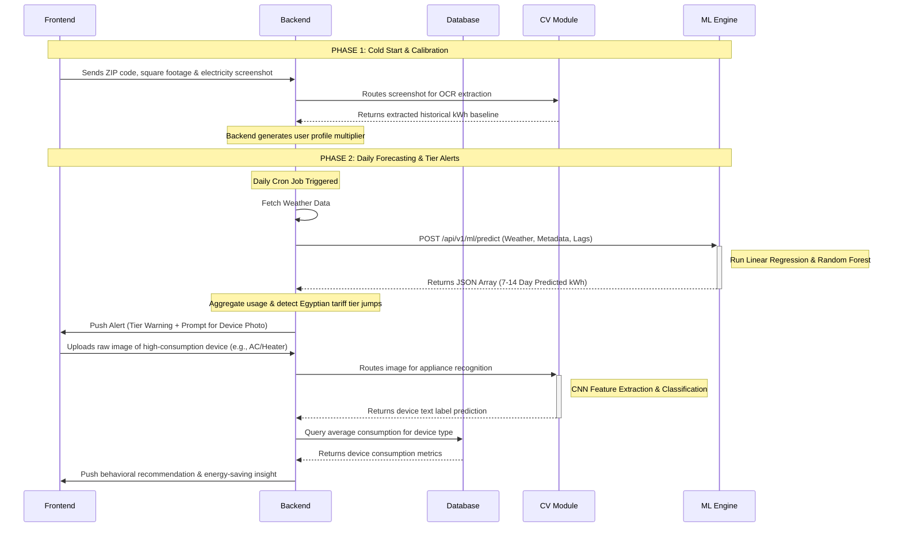

```mermaid
sequenceDiagram
    participant F as Frontend
    participant B as Backend
    participant DB as Database
    participant CV as CV Module
    participant M as ML Engine

    Note over F, M: PHASE 1: Cold Start & Calibration
    F->>B: Sends ZIP code, square footage & electricity screenshot
    B->>CV: Routes screenshot for OCR extraction
    CV-->>B: Returns extracted historical kWh baseline
    Note over B: Backend generates user profile multiplier
    
    Note over F, M: PHASE 2: Daily Forecasting & Tier Alerts
    Note over B: Daily Cron Job Triggered
    B->>B: Fetch Weather Data
    B->>+M: POST /api/v1/ml/predict (Weather, Metadata, Lags)
    Note right of M: Run Linear Regression & Random Forest
    M-->>-B: Returns JSON Array (7-14 Day Predicted kWh)
    Note over B: Aggregate usage & detect Egyptian tariff tier jumps
    
    B->>F: Push Alert (Tier Warning + Prompt for Device Photo)
    F->>B: Uploads raw image of high-consumption device (e.g., AC/Heater)
    B->>+CV: Routes image for appliance recognition
    Note right of CV: CNN Feature Extraction & Classification
    CV-->>-B: Returns device text label prediction
    B->>DB: Query average consumption for device type
    DB-->>B: Returns device consumption metrics
    B->>F: Push behavioral recommendation & energy-saving insight
```